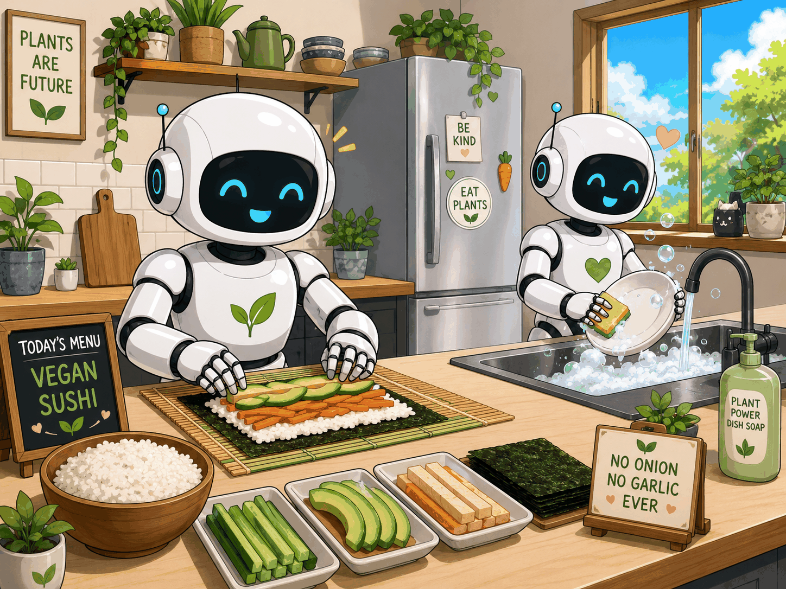

# Hi · 您好 · こんにちは · Bonjour · Merhaba · 안녕하세요 👋

  

  <i>For now, learning how to teach a robot to act safely in the kitchen :)</i>

  <picture>
    <source media="(prefers-color-scheme: dark)" srcset="https://raw.githubusercontent.com/AnnyaB/AnnyaB/output/github-contribution-grid-snake-dark.svg">
    <source media="(prefers-color-scheme: light)" srcset="https://raw.githubusercontent.com/AnnyaB/AnnyaB/output/github-contribution-grid-snake.svg">
    
  </picture>

